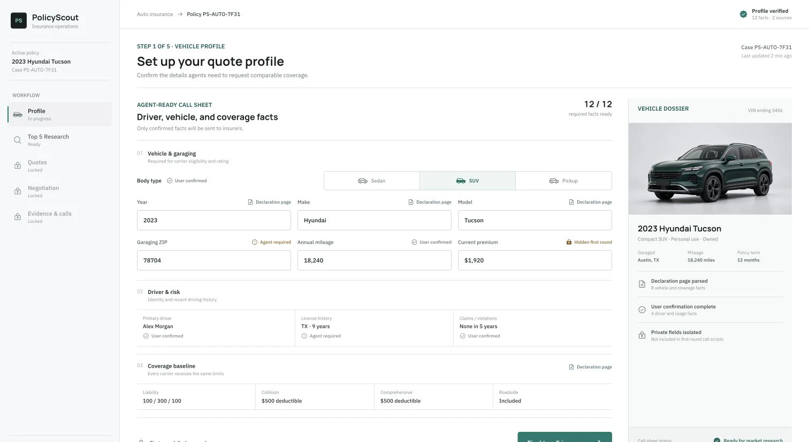

# PolicyScout

> An AI-assisted insurance-shopping and negotiation prototype built for MIT Hacks.

PolicyScout demonstrates a safer, more transparent way to shop for personal auto insurance: collect a confirmed profile, research eligible providers, normalize comparable quotes, let the user choose an offer, and document a same-coverage negotiation outcome. It pairs an evidence-first product workflow with a cinematic public demo.



## What this repository contains

The main application is a Next.js 16 app that demonstrates this five-stage flow:

1. Create a lightweight local demo account and confirm vehicle, location, and coverage facts.
2. Research and rank five eligible providers using a deterministic mock source, or Tavily when configured.
3. Collect five simulated, transcript-backed quotes and normalize them to a common policy-term cost.
4. Keep the system recommendation separate from the user's selected quote and private target.
5. Simulate a same-coverage negotiation and show the price trail, transcript, and result evidence.

The landing experience transitions from a scroll-driven vehicle sequence into the interactive workflow. The app has mock fallbacks, so the quote-shopping flow can be demonstrated without live insurance-provider access.

## Important prototype boundaries

PolicyScout is a hackathon prototype, not an insurance carrier, broker, quoting engine, or financial-advice service.

- Provider calls, quotes, and negotiation outcomes are simulated and non-binding unless explicitly marked otherwise.
- Public web research identifies providers and supporting evidence; it does not treat web prices, averages, or marketing claims as personalized quotes.
- Personal auto is the deeply implemented insurance line. Other lines use a generic extension point.
- The repository does not provide production authentication, policy binding, real insurer integrations, or real-world purchasing.
- Live voice and research integrations are optional and must be configured deliberately. They can incur third-party charges.

## Quick start

### Prerequisites

- Node.js 20 or newer
- Corepack (included with supported Node.js releases) to use the repository's pnpm version
- An Upstash Redis database to run the signed-in workflow end to end

Clone and install the project:

```bash
git clone https://github.com/ChiranshuDoshi/Negotiator-MITHacks.git
cd Negotiator-MITHacks
corepack enable
corepack pnpm install --frozen-lockfile
```

Create a `.env.local` file in the repository root. For the complete local workflow, add your Upstash Redis REST credentials:

```dotenv
UPSTASH_REDIS_REST_URL=https://<your-database>.upstash.io
UPSTASH_REDIS_REST_TOKEN=<your-token>
```

Start the development server:

```bash
corepack pnpm dev
```

Open [http://localhost:3000](http://localhost:3000). Create the demo account from the page, fill in the vehicle profile, and run the simulated workflow.

Without Redis, the public showcase still loads, but account creation and the persisted application workflow return a configuration error.

## Configuration

All secrets stay server-side. Do not commit `.env`, `.env.local`, generated `.artifacts/`, or API keys.

| Variable | Needed for | Notes |
| --- | --- | --- |
| `UPSTASH_REDIS_REST_URL` | End-to-end application workflow | Required with the token below. `KV_REST_API_URL` is also supported. |
| `UPSTASH_REDIS_REST_TOKEN` | End-to-end application workflow | Required with the URL above. `KV_REST_API_TOKEN` is also supported. Workflow records expire after seven days. |
| `TAVILY_API_KEY` | Live provider research | Optional. The app uses deterministic mock research if it is absent or unavailable. |
| `ELEVENLABS_API_KEY` | Voice quote collection and negotiation | Optional. Keep it server-only. Live scripts and browser voice flows may consume credits. |
| `ELEVENLABS_NEGOTIATOR_AGENT_ID` | Live negotiation voice flow | Created by the ElevenLabs setup script. |
| `ELEVENLABS_VOICE_SMOKE_AGENT_ID` | ElevenLabs voice smoke test | Created by the ElevenLabs setup script. |
| `ELEVENLABS_QUOTE_CALLER_AGENT_ID` | Interactive quote-collection demo | Created by the ElevenLabs setup script. |
| `ELEVENLABS_TWILIO_PHONE_NUMBER_ID` | Local outbound-call integration test path | Needed only for the guarded Twilio route. |
| `POLICYSCOUT_INTERNAL_API_KEY` | Direct, protected API routes | Use a strong server-to-server value and send it as `Authorization: Bearer <value>`. Not needed for the browser BFF workflow. |
| `DEMO_MODE=true` | Local ElevenLabs demo routes | Enables local-only conversation endpoints; those endpoints reject production and non-loopback requests. |

The application also recognizes `NEXT_PUBLIC_APP_URL`, `MAX_UPLOAD_MB`, and `DEFAULT_RETENTION_DAYS`; see [`src/config/env.ts`](src/config/env.ts) for validation defaults and the full optional configuration surface.

## Common commands

| Command | Purpose |
| --- | --- |
| `corepack pnpm dev` | Start the Next.js development server on `localhost`. |
| `corepack pnpm build` | Create a production build. |
| `corepack pnpm start` | Serve an existing production build. |
| `corepack pnpm lint` | Run ESLint. |
| `corepack pnpm typecheck` | Run TypeScript without emitting files. |
| `corepack pnpm test` | Run the full Vitest suite. |
| `corepack pnpm test:unit` | Run unit tests only. |
| `corepack pnpm test:integration` | Run route and workflow integration tests. |
| `corepack pnpm test:person3` | Run the ElevenLabs/Person 3 test subset. |

Run the standard verification set before sharing a change:

```bash
corepack pnpm lint
corepack pnpm typecheck
corepack pnpm test
corepack pnpm build
```

## Architecture at a glance

```text
Browser
  └─ Next.js app and cinematic showcase
       └─ same-origin application API (BFF)
            ├─ profile → provider research → quote collection → recommendation → negotiation
            ├─ Upstash Redis workflow store (seven-day TTL)
            ├─ Tavily provider research (optional; mock fallback)
            └─ ElevenLabs voice agents (optional; simulated flows remain available)
```

The domain layer uses strict Zod schemas, deterministic specification hashes, coverage-equivalence checks, and provider-safe disclosure rules. The system never sends a private target, acceptable range, or ceiling to a first-round provider call. Final negotiation results retain their before/after evidence and must be human-verified before any real transaction.

### Repository map

| Path | Contents |
| --- | --- |
| [`src/app`](src/app) | Next.js App Router pages and API routes. |
| [`src/components/showcase`](src/components/showcase) | Cinematic landing experience and interactive product demo. |
| [`src/backend/app`](src/backend/app) | Workflow orchestration, Redis state, and negotiation-call coordination. |
| [`src/backend/market-research`](src/backend/market-research) | Provider research, ranking, quote normalization, equivalence, and red-flag logic. |
| [`src/backend/negotiator`](src/backend/negotiator) | Conversation services and ElevenLabs/Twilio integrations. |
| [`src/domain`](src/domain) | Shared profiles, privacy rules, hashing, workflow state machine, and schemas. |
| [`tests`](tests) | Unit and integration coverage for contracts, workflow, routes, research, privacy, and voice scripts. |
| [`scripts`](scripts) | ElevenLabs provisioning, quote collection, negotiation preparation, and smoke checks. |
| [`supabase/migrations`](supabase/migrations) | Early Supabase schema exploration; it is not the current workflow store. |
| [`frontend`](frontend) | Standalone Vite version of the visual prototype, retained for design work. |
| [`design-previews`](design-previews) | Disposable design-direction prototypes and review material. |

## API surface

The browser uses the `/api/app/*` backend-for-frontend routes for signup, research, quote collection, workflow retrieval, and simulated or configured live negotiation.

The repository also exposes lower-level API routes for integration and contract testing:

- `POST /api/research/run` — deterministic mock or Tavily-backed provider research and Top Five ranking.
- `POST /api/quotes/normalize` — normalize structured quote outcomes and calculate comparable costs/red flags.
- `POST /api/recommendations` — rank qualifying offers and create the negotiation handoff.
- `POST /api/negotiations/validate-goal` — verify a selected quote and produce a disclosure-safe negotiation view.
- `POST /api/negotiations/leverage` — choose truthful, same-request competing-offer leverage.
- `POST /api/negotiations/validate-event` — validate before/after evidence and derive the effective offer.
- `POST /api/conversations/credentials` — issue local, same-origin demo credentials for a configured voice flow.

Protected direct routes require `Authorization: Bearer $POLICYSCOUT_INTERNAL_API_KEY`. Request and response schemas live in [`src/domain/schemas`](src/domain/schemas), and the route tests provide executable examples in [`tests/integration/routes.test.ts`](tests/integration/routes.test.ts).

## Optional: ElevenLabs voice setup

Voice support is intentionally optional. The normal simulated app workflow does not require an ElevenLabs account.

1. Add `ELEVENLABS_API_KEY` to `.env.local`. The key needs ElevenAgents write access and text-to-speech access.
2. Review the planned agent configuration, then apply it:

   ```bash
   corepack pnpm setup:elevenlabs
   corepack pnpm setup:elevenlabs -- --apply
   ```

   The apply step writes non-secret agent IDs to `.env.local`; it does not print or store your API key in artifacts.

3. Use one of the explicit smoke-test commands below. Commands with `--live` make external requests and may consume ElevenLabs credits.

   ```bash
   corepack pnpm test:elevenlabs:voice -- --live
   corepack pnpm test:elevenlabs:negotiation -- \
     --artifact-dir .artifacts/person4/<run-time> \
     --confirm-selection <provider-id>:<quote-id> \
     --target-cents <private-target-cents> \
     --live
   ```

For local browser-microphone quote collection, set `DEMO_MODE=true`, start the app on `localhost`, and visit `/dev/elevenlabs`. The route is unavailable in production and from non-loopback origins.

### Preparing a negotiation session

Prepare a private, local negotiation session from an existing Person 4 handoff before invoking the backend voice tools:

```bash
corepack pnpm prepare:elevenlabs:negotiation -- \
  --artifact-dir .artifacts/person4/<run-time> \
  --confirm-selection <provider-id>:<quote-id> \
  --target-cents <private-target-cents> \
  --profile tests/fixtures/fake_person_profile.json
```

This command writes the private goal to `.artifacts/person3/negotiation-session.json` with restricted permissions. It passes ElevenLabs only the display name and provider-safe quote context—not the private target, range, ceiling, or full goal object. Use `--user-name "Your Name"` instead of `--profile` when a profile file is unavailable.

For a no-credit validation, run:

```bash
corepack pnpm verify:elevenlabs:interruption -- --check
```

The corresponding `--live` command uses credits. The terminal microphone workflow additionally requires [`uv`](https://docs.astral.sh/uv/) and PortAudio; on macOS install it with `brew install portaudio`, then run `corepack pnpm talk:elevenlabs -- --check` or `--live`.

## Deployment notes

The production application needs an Upstash Redis REST database. On Vercel, add the Upstash Redis integration and make the REST URL/token available to both Preview and Production deployments. Set the appropriate Tavily and ElevenLabs variables only in environments where those capabilities are intentionally enabled, then redeploy after changing environment variables.

Never expose Redis tokens, ElevenLabs credentials, Tavily credentials, or `POLICYSCOUT_INTERNAL_API_KEY` with a `NEXT_PUBLIC_` prefix.

## Further reading

- [`BACKEND.md`](BACKEND.md) — shared contracts, domain guarantees, and intentionally deferred backend hardening.
- [`PRD.md`](PRD.md) — product journey, public showcase requirements, and demo acceptance criteria.
- [`negotiation.md`](negotiation.md) — safety and negotiation instructions for the voice agent.
- [`people_split.md`](people_split.md) — original hackathon ownership split and integration boundaries.
- [`design-previews/README.md`](design-previews/README.md) — visual design direction prototypes.

## Contributing and project interest

Issues and pull requests are welcome for focused, testable improvements. Before opening a change, read the relevant domain contracts, keep the user-selection and privacy boundaries intact, and run the verification commands above. Avoid committing secrets, generated artifacts, local databases, or unrelated design exports.

If you are evaluating or building on PolicyScout, please keep its prototype status visible: do not present simulated quotes, research, or negotiations as live insurance offers. Real-world use would require licensed-domain review, authenticated ownership, encrypted and access-controlled data handling, auditability, rate limiting, provider agreements, and human verification of every actionable result.

## License

No license file is currently included in this repository. All rights are reserved by default; contact the repository owner before reusing the code or assets outside the scope they authorize.
