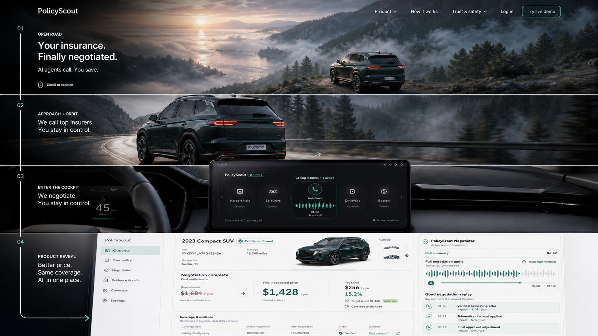

# PolicyScout Cinematic Showcase

## Decision

Build the cinematic experience as a public `Showcase / Live Demo` route, separate from the authenticated product shell. The showcase earns attention with a scroll-driven vehicle journey, then resolves into the real PolicyScout dashboard and a short interactive demo.

The concept is called **Road to Result**.

## Why This Structure

- The landscape and vehicle create the first-visit wow moment.
- The camera movement has a product destination: the infotainment display becomes the PolicyScout interface.
- Returning users can bypass the cinematic sequence and go directly to `Log in` or `Dashboard`.
- The real product remains a compact, trustworthy SaaS interface rather than inheriting a marketing-page layout.

## Mercury Reference Takeaways

The useful pattern is not the mountain image by itself. Mercury pins the scene while continued wheel input advances the camera from a distant environment to a device close-up, then replaces the physical device with the product UI. PolicyScout should reuse that pacing model without copying Mercury's scene, branding, copy, or laptop composition.

## Scroll Choreography

Use one full-screen sticky stage inside a section approximately `520vh` tall. Scroll progress drives a deterministic camera timeline; the page does not jump between independent sections.

| Progress | Scene | Camera and UI behavior |
| --- | --- | --- |
| `0-16%` | Open road | Wide dawn landscape. The car is visible but small. Headline, `Try live demo`, `Log in`, and `Skip intro` remain readable. |
| `16-38%` | Approach | Dolly toward the vehicle. Foreground road, trees, and mist move at different rates to establish depth. Hero copy fades before it can overlap the car. |
| `38-58%` | Orbit | Camera follows a controlled `120-150deg` side-to-rear arc. Do not run a full 360-degree configurator spin; it delays the product reveal. |
| `58-72%` | Enter cockpit | Move through the rear-side cabin line into the interior. Reflections soften and the environment darkens so the center display becomes the focal point. |
| `72-84%` | Screen lock | Camera becomes orthographic and aligns the infotainment rectangle with the browser viewport. Physical bezels become the product frame. |
| `84-100%` | Product reveal | PolicyScout expands to a real DOM interface. Scrolling is released and the user can operate the demo. |

The camera must never imply that the user should operate PolicyScout while driving. Production copy should describe preparation and negotiation before a trip, not use "while you drive."

## First Viewport

**Headline:** `Your insurance. Finally negotiated.`

**Support:** `PolicyScout compares five matched quotes, then calls again for a better result.`

**Primary CTA:** `Try live demo`

**Secondary CTA:** `Log in`

Keep the car and environment unobstructed. Text sits directly over the scene with a controlled contrast scrim, not inside a floating card.

## Interactive Demo

The expanded screen becomes a compact three-stage product demo. It should use real controls and realistic mock data rather than a narrated feature carousel.

### 1. Add Your Car

- Year, make, model, ZIP code, and current annual premium.
- Optional `Use demo vehicle` action preloads `2023 Compact SUV`.
- No sensitive personal data is required in the public demo.

### 2. Watch The Calls

- One command starts five simulated insurer calls.
- Five compact status rows show `Queued`, `Calling`, `Quote verified`, or `Needs review`.
- The active row includes a restrained waveform and elapsed time.
- Evidence drawers expose rating source, quote timestamp, matched coverage, and transcript excerpt.

### 3. See The Negotiated Result

- Best verified quote: `$1,684/year`.
- User target: `$1,450/year`.
- Final result: `$1,428/year`.
- Savings: `$256/year`, `15.2%`.
- Target achieved and coverage unchanged are visible beside the price.
- Full audio, synchronized transcript, and timestamped `Good negotiation replay` clips remain available.

The demo may preselect the system recommendation for speed, but it must label that choice as `PolicyScout recommendation` and keep it distinct from `Your selection`.

## Visual System

- **Environment:** alpine or coastal dawn, realistic mist, deep natural greens, cool sky, warm sunrise only as a secondary accent.
- **Vehicle:** one consistent dark emerald compact SUV across every frame; no manufacturer logo.
- **Showcase surfaces:** ink `#101817`, mist `#E8EFEC`, teal `#087B70`, mint `#7DE2C4`, warning amber `#B7791F`.
- **Product surfaces:** white and cool neutral panels with dark ink text; the voice and replay panel may use the dark showcase palette.
- **Type:** Geist or Inter; compact navigation and dashboard scale, with hero type reserved for the first viewport only.
- **Radius:** `6-8px` for product panels and controls. The landscape remains unframed and full bleed.

## Motion Rules

- Use scroll position as the source of truth; avoid autonomous camera motion after the user stops.
- Apply spring easing only to UI values and status changes, not to the main camera path.
- Animate price changes with a short digit roll and a settled final state.
- Highlight replay clips by moving the audio playhead and transcript focus together.
- Keep `Try live demo`, `Log in`, and `Skip intro` keyboard reachable throughout the pinned sequence.
- Under `prefers-reduced-motion`, show the hero poster, crossfade once to the product frame, and provide a direct `Open demo` action.

## Responsive Behavior

### Desktop

- Full scroll-scrubbed cinematic sequence.
- Keep the car within the center `60%` safe area so ultrawide crops do not cut it off.
- Product reveal ends at a maximum content width of `1440px` while the stage background remains full width.

### Mobile

- Do not attempt the full real-time camera orbit.
- Use three pre-rendered keyframes: landscape, rear three-quarter, and cockpit screen.
- Advance with short scroll-linked crossfades and scale changes.
- Surface `Skip to demo` in the first viewport and start the interactive demo immediately after the third frame.

## Recommended Build Strategy

For the hackathon, use a pre-rendered image sequence or a tightly encoded scroll-scrub video for the car and environment, then switch to real DOM at the screen-lock point. This gives predictable art direction and avoids making a 3D asset pipeline a release dependency.

- `Motion` / Framer Motion: scroll progress, copy fades, price changes, and replay focus.
- `ui-animation`: motion timing, reduced-motion behavior, and interaction review.
- `fixing-motion-performance`: transform/compositing and scroll performance review.
- `React Three Fiber`: stretch goal only if a production-ready vehicle model, lighting, and device testing are available early.

## Asset Checklist

- Wide hero poster with safe desktop and mobile crops.
- One consistent vehicle model and paint treatment.
- Side-to-rear orbit sequence with stable reflections and wheel geometry.
- Cockpit transition and center-screen mask.
- Dark voice-call screen rendered inside the physical display.
- Light dashboard end frame matching the real application.
- Mobile keyframes and reduced-motion poster.

## Performance Gates

- Hero poster should render before cinematic assets are required.
- Defer orbit and cockpit media until after the first frame is visible.
- Target a smooth `60fps` desktop interaction and a stable `30fps` mobile fallback.
- Keep the cinematic media budget below approximately `10MB` for the demo route, with the first viewport below `500KB` where practical.
- Never block `Log in`, `Skip intro`, or the product route on media loading.

## Main Risks

1. **The car overshadows the insurance product.** Reveal the live quote-call UI by the second major scroll movement and keep product CTAs persistent.
2. **A full 360-degree sequence feels like a vehicle configurator.** Use a shorter rear arc that ends at the cockpit.
3. **Heavy 3D hurts the demo.** Ship pre-rendered media first and treat real-time 3D as optional.
4. **The cinematic sequence slows returning users.** Keep direct login/dashboard navigation and remember intro completion locally.
5. **Marketing claims become ambiguous.** Keep simulated-provider disclosure, quote verification, evidence, and unchanged-coverage status in the demo UI.

## Approval Boundary

This storyboard defines the visual and motion target. After approval, implementation should cover only the cinematic route and its three-stage demo transition; it should not redesign the authenticated dashboard again.
