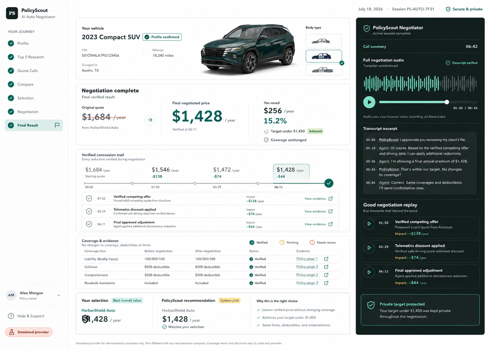

# PolicyScout Hybrid Product Design Direction

Status: proposed visual target, awaiting approval before frontend implementation.

## Direction

Combine three strengths into one product system:

- Evidence-first information hierarchy for insurance trust.
- A dark voice command panel that makes the negotiator feel active and inspectable.
- A result-first concession trail that explains how the price moved.

The interface should feel like a calm fintech workspace. The user's vehicle provides identity and emotional relevance, but it must not turn the dashboard into a marketing page.

## Primary Layout

1. **Workflow rail:** persistent steps from Profile through Final Result. Completed, active, pending, error, and needs-review states use text, icon, and color together.
2. **Vehicle identity band:** confirmed body type, year, mileage, location, and a clear vehicle visual. Small sedan, SUV, and pickup selectors communicate that PolicyScout understands different vehicles.
3. **Negotiation outcome:** original price, verified final price, savings, target status, and coverage confirmation in one scan line.
4. **Verified concession trail:** `$1,684 -> $1,546 -> $1,472 -> $1,428`, with timestamp, cause, impact, and evidence for every change.
5. **Coverage and evidence table:** before/after coverage values, confidence state, and direct evidence links.
6. **Negotiator command panel:** full audio, waveform, synchronized transcript, replay clips, and private-target protection.
7. **Recommendation boundary:** the system recommendation and the user's selection remain separate, even when they match.

## Eight-Screen System

### 1. Login And Signup

Use one focused authentication surface with a quiet vehicle visual and a short trust statement. After authentication, returning users enter the dashboard immediately; no repeated intro animation.

### 2. Profile Setup

Use a progressive wizard with 3-5 related fields per step rather than one question per page. Keep completion, why-the-field-is-needed help, validation, document extraction, and voice intake visible. The selected vehicle updates in the identity band as body type, year, and color are confirmed.

### 3. Top 5 Research

Use one ranked table or list surface. Each provider row includes rating, review count, source, eligibility, recency, and a compact reason for inclusion. Evidence opens in a drawer instead of expanding every row.

### 4. Call Status

Use five provider rows with queued, connecting, speaking, extracting, completed, declined, and failed states. A transcript/evidence drawer opens from the selected row. Avoid five decorative cards.

### 5. Quote Comparison

Use a normalized comparison table with price, limits, deductibles, discounts, fees, confidence, and red flags. Keep the system recommendation badge independent from the user's radio selection.

### 6. Selection And Target

Pin the selected quote summary beside the target-price or target-range form. Show what the negotiator may disclose, what remains private, and whether the target is realistic without silently changing coverage.

### 7. Negotiation Progress

Expand the dark command panel into the main working surface. Show call state, elapsed time, live waveform, transcript, structured events, and the current verified price. Do not animate price until a concession is confirmed.

### 8. Final Result

Use the proposed mockup: before/after price, savings, target outcome, unchanged coverage, full audio, transcript evidence, replay clips, concession trail, and recommendation boundary.

## Vehicle Wow Moment

Use this once, immediately after the vehicle profile is confirmed:

1. Sedan, SUV, and pickup visuals enter as a short body-type chooser.
2. Unselected vehicles recede; the confirmed body type settles into the vehicle identity band.
3. Year, color, and confirmed-profile status resolve beside it.
4. The scene completes in approximately `1.4-1.8s`, then becomes a static product surface.

For the hackathon, use three high-quality pre-rendered 2.5D vehicle assets and Motion/CSS transitions. This is faster and more reliable than loading a full 3D scene. Add React Three Fiber only as a stretch goal when model assets and mobile performance are proven.

With `prefers-reduced-motion`, skip the arrival sequence and show the selected vehicle immediately.

## Negotiator Number Motion

The negotiator should be felt through verified cause and effect, not decorative counting:

- Animate only confirmed concessions: `$1,684 -> $1,546 -> $1,472 -> $1,428`.
- Pair every number change with a timestamp, tactic, transcript evidence, and impact.
- Use a short vertical number transition or digit pop, under `500ms`.
- Keep routine status motion under `300ms`.
- Reveal final savings only after the final price event is verified.
- Never use slot-machine motion, infinite counters, or animation for unchanged values.

## Visual System

- Typography: Geist or IBM Plex Sans; one UI family plus optional mono for timestamps and identifiers.
- Canvas: cool neutral `#F4F7F6`.
- Ink: `#102A2E`.
- Trust accent: teal `#087A68`.
- Information accent: blue `#327694`.
- Warning: amber `#C98A19`.
- Error: restrained red `#C64E45`.
- Dark command panel: deep green-black `#0D1D19`.
- Radius: `4-8px`; use dividers and surface tint before shadows.

## States

- **Empty:** explain the next required action and preserve the workflow step.
- **Loading:** use row skeletons and deterministic progress labels.
- **Pending:** show what PolicyScout is waiting for and whether the user may leave safely.
- **Success:** identify the verified event and its evidence.
- **Error:** explain impact, preserve completed work, and provide one retry action.
- **Partial result:** keep completed provider outcomes visible and label missing comparisons.

## Skill Recommendation

Use the existing `frontend-design`, `shadcn`, and `ui-animation` skills for the core implementation.

Recommended additions:

- `freshtechbro/claudedesignskills@react-three-fiber`: optional stretch skill for an interactive 3D vehicle scene. Current discovery showed about 1.7K skill installs; use only after the 2.5D MVP works.
- `ibelick/ui-skills@fixing-motion-performance`: recommended motion QA skill for compositor safety, mobile performance, and reduced-motion validation.

No additional number-specific skill is required. The installed `ui-animation` skill already includes number-pop, state-swap, timing, interruption, and reduced-motion patterns.

Do not use the currently discovered Rive skill as the primary solution: its adoption and source reputation are materially weaker, and it still requires separate `.riv` asset authoring.

## Risks And Tradeoffs

- Exact make/model vehicle matching requires licensed assets or a reliable VIN-to-model asset pipeline. The MVP should promise body type and color fidelity, not an exact digital twin.
- A 3D vehicle can increase load time and distract from the quote workflow. It must degrade to a static image and never block dashboard readiness.
- The dark command panel should remain limited to active negotiation and replay surfaces; using it across the whole app would reduce the light fintech trust signal.
- Dense comparison tables need mobile-specific prioritization, not horizontal desktop tables squeezed into a phone viewport.
